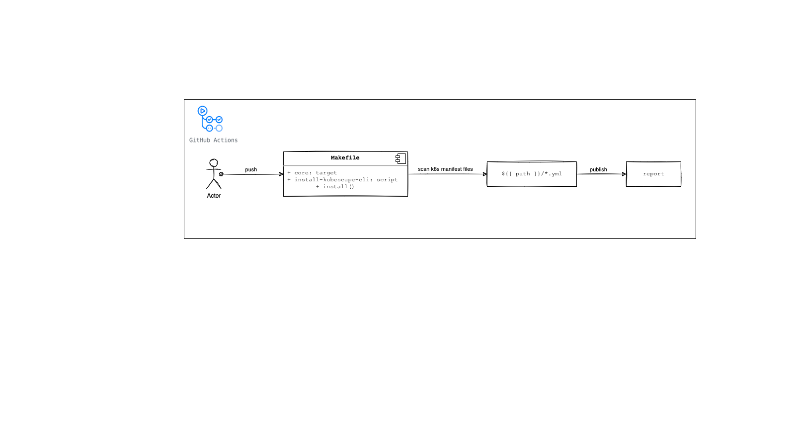
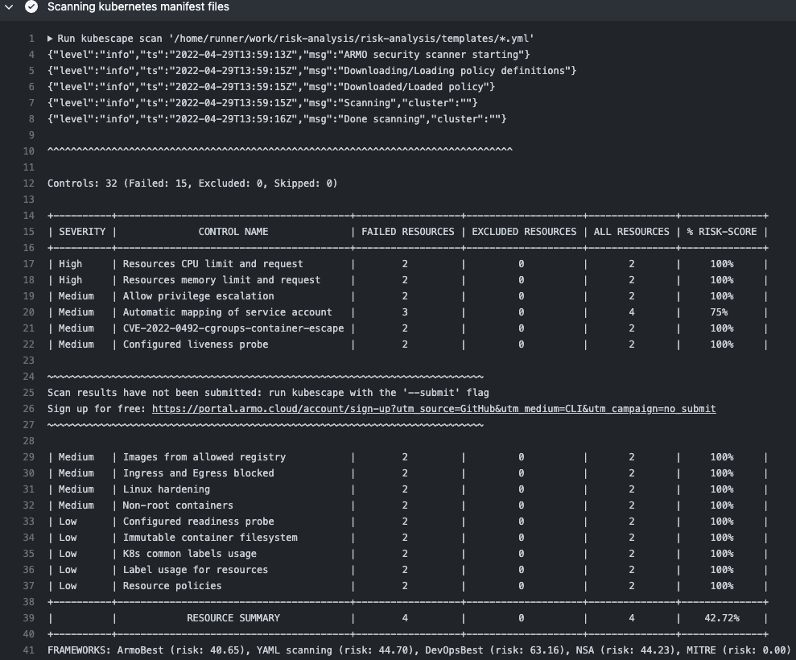

# K8S Risk Analysis

This project is use case to scans k8s manifest files.

This project is based on [kubescape](https://github.com/armosec/kubescape), an open-source tool that can be used to do cluster risk analysis, security compliance, RBAC visualizer and image vulnerabilities scanning.



# Steps

## Step 1 - Pub of new k8s manifest

In this step, the developer or operator publishes a new manifest to the git repository to deploy a new application on the k8s cluster. 

This action is usually accompanied by the command ```git push```.

## Step 2 - Pipeline triggering

When the new manifest is uploaded, the pipeline fires and starts running.

In this phase of the function ```install()``` on python script (```./todo/install-kubescape-cli.py```). is runnning by makefile target.

## Step 3 - Scan and Vulnerabilities Report

In this phase, all manifest files present in the indicated path are analyzed and as a result a report like this can be seen in the pipeline:



# Contributions

To contribute and report problems is very easy, just follow this [Doc](https://github.com/moquintanilha/risk-analysis/blob/main/docs/contribution/README.md)


