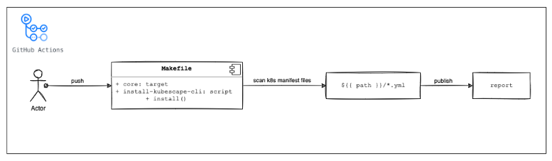

# K8S Risk Analysis

This project is use case to scans k8s manifest files.

This project is based on [kubescape](https://github.com/armosec/kubescape), an open-source tool that can be used to do cluster risk analysis, security compliance, RBAC visualizer and image vulnerabilities scanning.

